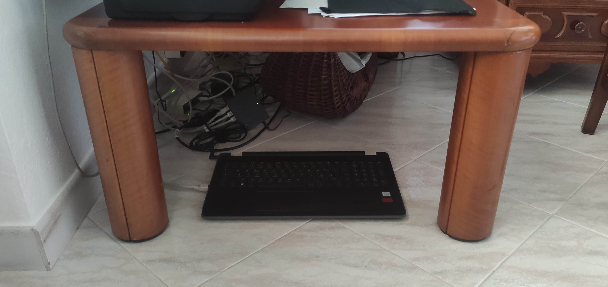

+++
title = "My Home Server"
date = 2024-04-02
description = "Server powered by Docker containers"
[extra]
toc = false
insert_anchor_links = "none"
icon = "docker"
+++

## Old laptop, let's use it
The project came to my mind after discovering the existence of media-serving solutions like Plex or Jellyfin. I was also interested in polishing my skills on Docker containers, so I picked up my old laptop, the chosen "_server_", and started playing.

## Docker? Containers?
For those who don't know what I am talking about, _Docker is an open source platform that enables developers to build, deploy, run, update and manage containers, standardized and executable components that combine application source code with the operating system (OS) libraries and dependencies required to run that code in any environment._ With cooler words, you can summarize the previous statement with _Develop faster, run everywhere._ 

Another awesome thing about [Docker](https://www.docker.com/) lies in its ease of use. To make you understand the potential of what I am talking about, the following snippet shows how to start a bash session in container based on the Ubuntu image. Yes, Virtual Machines have been already invented, but this is way FASTER.

```
ubuntu@victus:~$ docker run -it ubuntu /bin/bash
Unable to find image 'ubuntu:latest' locally
latest: Pulling from library/ubuntu
bccd10f490ab: Pull complete
Digest: sha256:77906da86b60585ce12215807090eb327e7386c8fafb5402369e421f44eff17e
Status: Downloaded newer image for ubuntu:latest
root@062f46837057:/#
```

A container based on an Ubuntu image may not sound so revolutionary. But on top of this image you could add other software components, from a simple python application to whole frontend/backend solutions. From this, you then could make your own personalized Docker image, with all the necessary dependencies already declared inside it.
You have now acquired a tool which allows you to easily distribute your application, with the only requirement that the system must host a Docker engine. 

Following this line of thought, lots of open-source Docker Images were developed. You can have a look at some of them at [Docker Hub](https://hub.docker.com/) if you are curious. Enough for the introduction, let's get to something more concrete.

## System

The pc I am using is my first laptop, which retired after 5 stressful long years of University. It is equipped with an Intel i5 8th gen processor, 8 GB of ram DDR4, an SSD of 128 GB and HHD of 1 TB. These are more than enough requirements if you are planning of just serving your medias or backup your photos. The system has also an onboard low-end GPU, which I did not bother neither to disable from the BIOS nor to remove it. After setting up the OS and installing an ssh server, I removed the laptop screen, to reduce the system power consumption and to make it as less invasive as possible. I set up a static IP, placed the sever near my home modem/router and connect it via an Ethernet cable.

<div class="flex flex-col md:flex-row" style="margin-top: -20px; margin-bottom: -20px;">
    <div style="padding: 5px;" >
        
    </div>
    <div style="padding: 5px;">
          
    </div>
</div>

## Installation

The system runs on a Debian server image. I don't need the system to run 24/7 since I mainly use it when I am home at night. The only automation I implemented is the system automatic shutdown scheduled for 01:30 AM.

The services hosted by the server were all installed using Docker. To make things maintainable, I created a script which automatically set up the system by:

* Installing the Docker engine and ssh server
* Setting up the system automatic shutdown
* Installing the services via a [Docker Compose](https://docs.docker.com/compose/) file 

You can find the setup script on my [GitHub repo](https://github.com/nicolamarchiotto/media-server-script).

# Services

The server host a discrete number of applications, I'll quickly list some of them 

### Jellyfin
[Jellyfin](https://jellyfin.org/) is a media serving solution. It allows you to share your media over the network. I use it to watch the shows and films on my server on my tv
### FileBrowser
[Filebrowser](https://filebrowser.org/) is exactly what you expect, a file explorer on the system which expose a web-UI to perform file-management operations.
### Photoprism
[Photoprism](https://www.photoprism.app/) is an app which allows you to easily manage and organize your photos. I use it to back up all my phone photos exploiting the smartphone app [Photosync](https://www.photosync-app.com/home) and the compatible synchronization via WebDAV.
### Homer
[Homer](https://github.com/bastienwirtz/homer) is a simple app developed by [bastienwirtz](https://github.com/bastienwirtz) which allows you to access your server services from a single page


<div class="container">
  <div id="myCarousel" class="carousel slide" data-ride="carousel">
    <ol class="carousel-indicators">
      <li data-target="#myCarousel" data-slide-to="0" class="active"></li>
      <li data-target="#myCarousel" data-slide-to="1"></li>
      <li data-target="#myCarousel" data-slide-to="2"></li>
    </ol>
    <div class="carousel-inner">
      <div class="item active">
        
      </div>
      <div class="item">
        
      </div>
      <div class="item">
        
      </div>
    </div>
    <a class="left carousel-control" href="#myCarousel" data-slide="prev">
      <span class="glyphicon glyphicon-chevron-left"></span>
      <span class="sr-only">Previous</span>
    </a>
    <a class="right carousel-control" href="#myCarousel" data-slide="next">
      <span class="glyphicon glyphicon-chevron-right"></span>
      <span class="sr-only">Next</span>
    </a>
  </div>
</div>