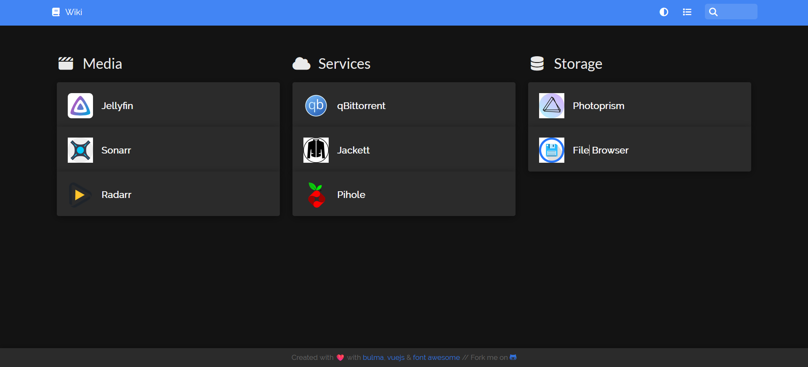
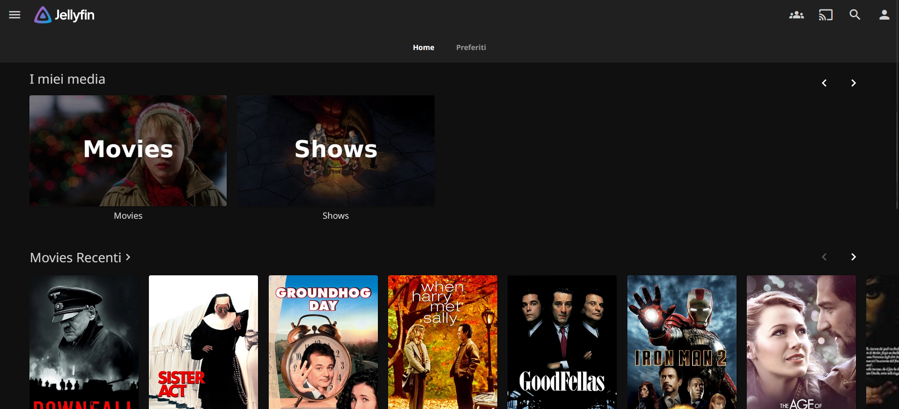
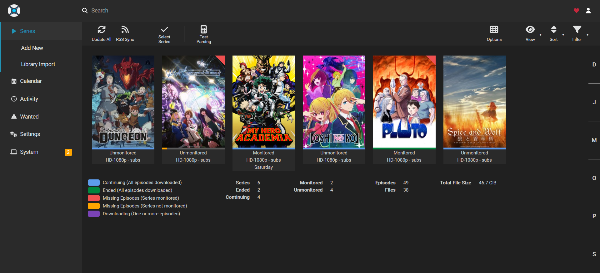
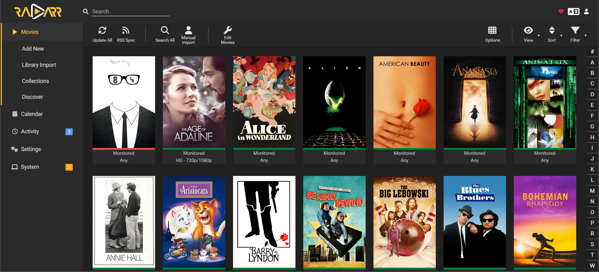
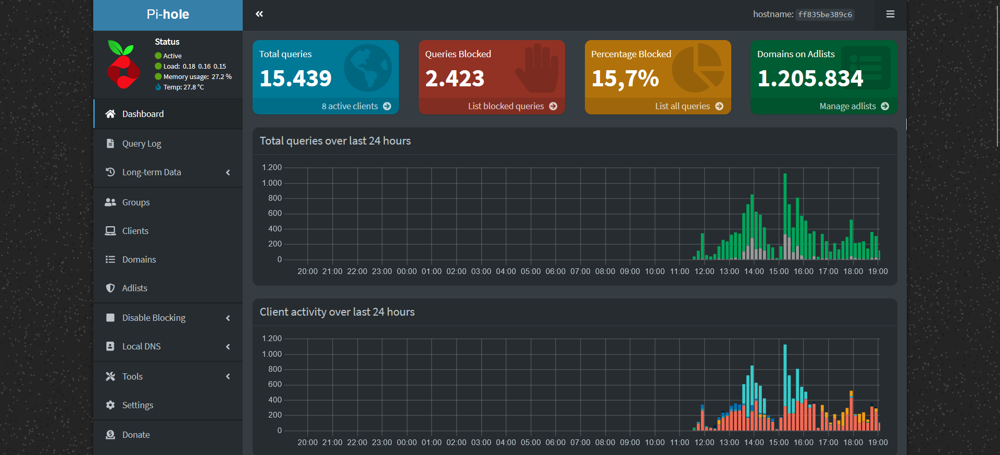
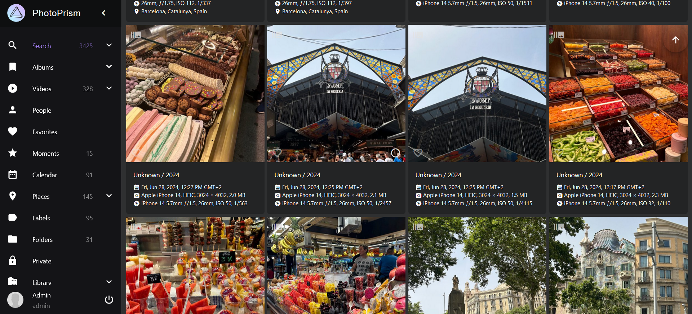
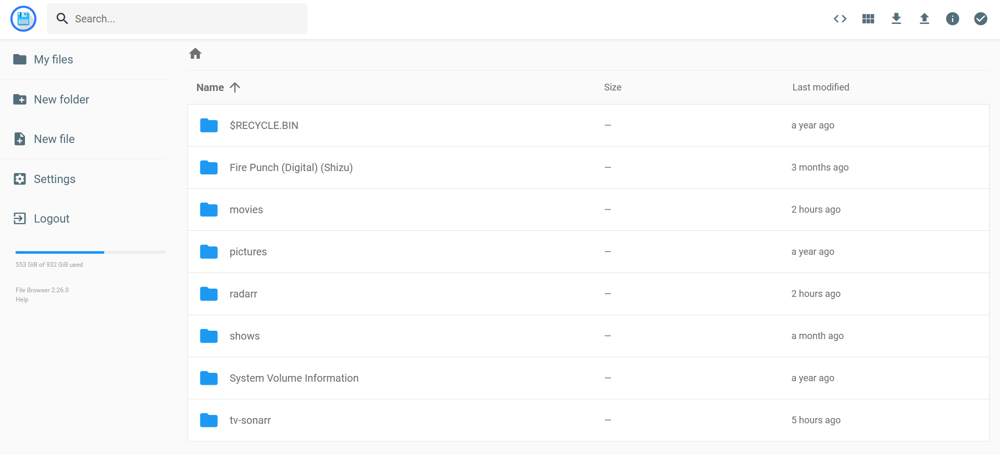

+++
title = "My Home Server"
date = 2024-08-13
description = "Server powered by Docker containers"
[extra]
toc = false
insert_anchor_links = "none"
icon = "docker"
+++

## Old Laptop, Let's Use It
The project came to my mind after discovering the existence of media-serving solutions like Plex or Jellyfin. I was also interested in polishing my skills on Docker containers, so I picked up my old laptop, the chosen "_server_", and started playing.

## Docker? Containers?
For those who don't know what I am talking about, _Docker is an open source platform that enables developers to build, deploy, run, and manage **containers**, standardized and executable components that combine the application source code, the software dependencies, and the operating system (OS) required to run the application in any environment.

With fewer words, Docker allows you to build your program in a standalone and secure environment with an already integrated OS. This translates to:

- Easier software distribution;
- Assurance of the host machine setup. With Docker you will never hear again _"but it works on my machine"_.

With respect to Virtual Machines, which are tricked by the hypervisor layer to run on real hardware, Docker containers are more friendly with the host and just emulate a minimal file system. They need less time to startup and are typically faster.

[Docker](https://www.docker.com/) is also incredibly easy to use. To make you understand the potential of what I am talking about, the following snippet shows how to start a bash session in a container based on the Ubuntu image. To run it, only 10 seconds were necessary!

```
ubuntu@victus:~$ docker run -it ubuntu /bin/bash
Unable to find image 'ubuntu:latest' locally
latest: Pulling from library/ubuntu
bccd10f490ab: Pull complete
Digest: sha256:77906da86b60585ce12215807090eb327e7386c8fafb5402369e421f44eff17e
Status: Downloaded newer image for ubuntu:latest
root@062f46837057:/#
```

A container based on an Ubuntu may not sound so revolutionary. But on top of this image you could add other software components, from a simple python application to whole frontend/backend solutions. From this, you could then create your own personalized Docker image and distribute it, with the only requirement that the system must host the Docker engine. 

Following this line of thought, lots of open-source Docker images were developed. You can take a look at some of them at [Docker Hub](https://hub.docker.com/) if you are curious. 

The most mind-blowing project I found is [dockur/windows](https://github.com/dockur/windows), a Docker image which allows you to host Windows (from XP to W11) inside a container in a legal way using free-trial licenses, and automating the windows tedious installation process. It saved me when I needed to configure some old IT hardware with software compatible only with Windows XP. 

Enough for the introduction, let's get to the server.

## System

The system I am using is my first laptop, which retired after 5 stressful long years of Computer Science University. It is equipped with an Intel i5 8th gen processor, 8 GB of ram DDR4, an SSD of 128 GB and HHD of 1 TB. After setting up the OS and installing an SSH server, I removed the laptop screen to reduce the system power consumption and to make it as less invasive as possible. I set it up with a static IP, placed the sever near my home modem-router and connect it via Ethernet cable.

<div class="double-image-div">
    <div class="image-overlay double-image-left-div">
        
    </div>
    <div class="image-overlay double-image-right-div">
          
    </div>
</div>

## Installation

The system runs on an Ubuntu server image. I don't need the system to run 24/7 since I mainly use it when I am home at night. The only automation I implemented is the system automatic shutdown scheduled for every day at 01:30 AM.

The services hosted by the server were all installed using Docker. To make things maintainable, I created a script that automatically set up the system by:

* Installing the Docker engine and the SSH server;
* Setting up the system automatic shutdown;
* Installing the services via a [Docker Compose](https://docs.docker.com/compose/) file.

You can find the setup script on my [GitHub repo](https://github.com/nicolamarchiotto/media-server-script).

## Services

The server hosts a discrete number of applications. I'll quickly list them: 

- [Jellyfin](https://jellyfin.org/) is a media serving solution. It allows you to share your media over the network;
- [Filebrowser](https://filebrowser.org/) is exactly what you expect, a file explorer on the system that exposes a web-UI to perform file-management operations;
- [Photoprism](https://www.photoprism.app/) is an app that allows you to easily manage and organize your photos. I use it to back up all my phone photos exploiting the mobile app [Photosync](https://www.photosync-app.com/home) and the compatible synchronization via WebDAV;
- [qBittorrent](https://www.qbittorrent.org/download) Torrent client to download whatever you want;
- [Sonarr](https://sonarr.tv/) and [Radarr](https://radarr.video/) are two apps for respectively managing shows and movies;
- [Pi-hole](https://pi-hole.net/) is an application that functions both as an ad-blocker for my network and as a local DNS server;
- [Homer](https://github.com/bastienwirtz/homer) is a simple app developed by [bastienwirtz](https://github.com/bastienwirtz) that allows you to access your server services from a single page.

<div>
  <div id="myCarousel" class="carousel slide" data-ride="carousel" data-interval="false">
    <ol class="carousel-indicators">
      <li data-target="#myCarousel" data-slide-to="0" class="active"></li>
      <li data-target="#myCarousel" data-slide-to="1"></li>
      <li data-target="#myCarousel" data-slide-to="2"></li>
      <li data-target="#myCarousel" data-slide-to="3"></li>
      <li data-target="#myCarousel" data-slide-to="4"></li>
      <li data-target="#myCarousel" data-slide-to="5"></li>
      <li data-target="#myCarousel" data-slide-to="6"></li>
    </ol>
    <div class="carousel-inner">
      <div class="item active image-overlay">
          
      </div>
      <div class="item image-overlay">
          
      </div>
      <div class="item image-overlay">
          
      </div>
      <div class="item image-overlay">
          
      </div>
      <div class="item image-overlay">
          
      </div>
      <div class="item image-overlay">
          
      </div>
      <div class="item image-overlay">
          
      </div>
    </div>
    <a class="left carousel-control" href="#myCarousel" data-slide="prev">
      <div class="icon-prev" style="color: white; -webkit-text-stroke: 1px #000;">
      </div>
    </a>
    <a class="right carousel-control" href="#myCarousel" data-slide="next">
      <div class="icon-next" style="color: white; -webkit-text-stroke: 1px #000;">
      </div>
    </a>
  </div>
</div>

## Performance

Sometimes Jellyfin struggles to serve some media files, thus resulting in a stuttering video. This is probably due to the format in which some videos are encoded and to the relative old CPU. This occurred to me maybe twice since I set up the system one year ago, so nothing too impactful. Apart from this, I never had major problems. 

## To Do

There are other things I would like to add on a future version of the server.

- Set up the system in a raid configuration;
- Expose the system to the internet safely for hosting a file sharing solution, i.e., [Nextcloud](https://nextcloud.com/it/), and have a local instance of [Bitwarden](https://bitwarden.com/) and [GitHub](https://github.com/).

## External References

- My [GitHub repo](https://github.com/nicolamarchiotto/media-server-script) with the project source code.
